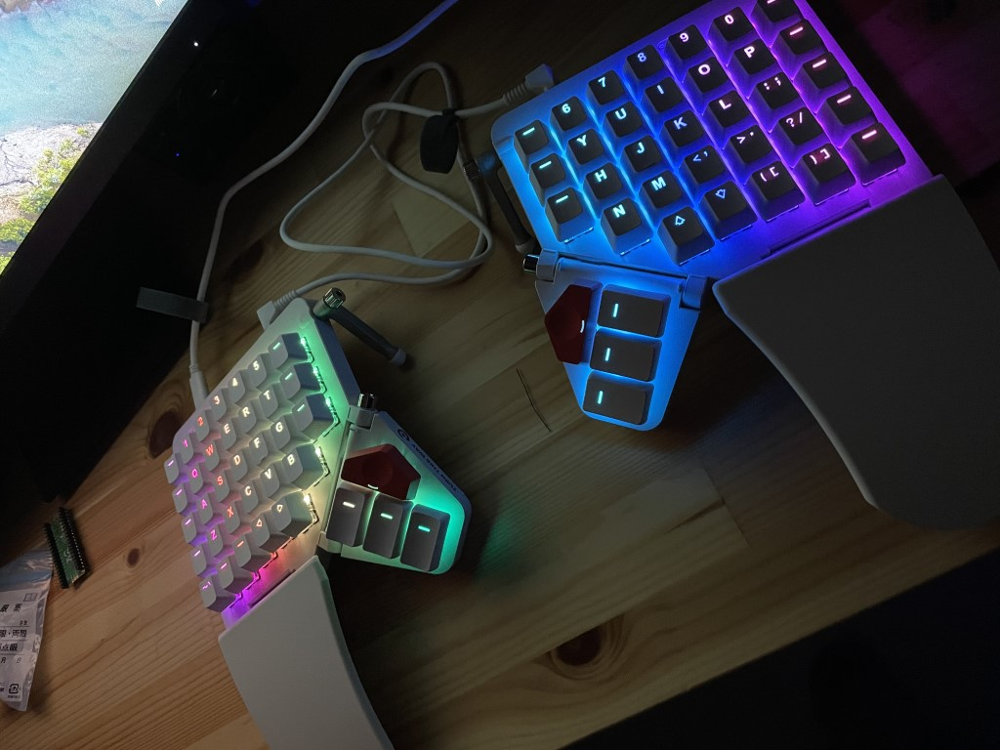

# 経緯など
---
以前から遊舎工房で購入した自作分割キーボードを使っておりました。
あるときに、弟からこの「Moon Lander」の存在を知らされて即買いしてしまいました。

# 購入
---
以下のサイトから購入しました。
[ZSA Moonlander: Next-gen Ergonomics](https://www.zsa.io/moonlander/)
	
価格は４万円しない程度だったと思います。
色、キースイッチが選択可能でした。（キースイッチの種類や特性については割愛）
私は銀軸を選択しました。

台湾からの輸送ですが、送料は無料で自分の場合は２週間程度で自宅に届きました。

通常のキーボードと配列が全然違いますが、以前から分割キーボードを使っていたのでそこまで苦労していません。

