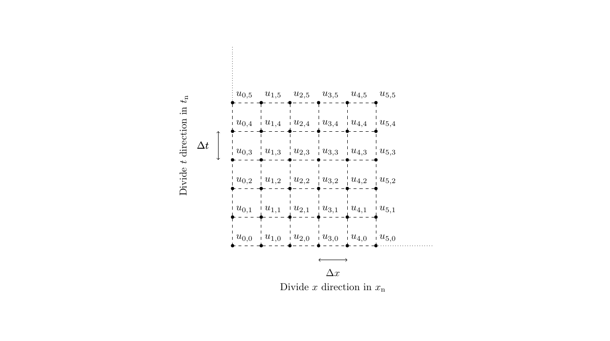

## 熱平衡式の基本
---
比熱$c$、熱伝導率$k$を定数としたときの1次元熱平衡方程式は以下のように表される。
$$
\lambda c \frac{\partial u}{\partial t} = k \frac{\partial^2 u}{\partial x^2}
$$
ここで$\lambda$、$u$はそれぞれ密度(g/m$^3$)、温度（K）を示す。
コンピュータによる数値計算では連続な関数に対して直接計算を行うことができないため、上記の偏微分方程式を**離散化**することによって計算を行う。
以下の図のようにx軸方向とt軸方向に対して離散化を行う。

図ではx方向（解析対象の長手方向）に$x_\mathrm{n}$個、t方向（解析時刻）に$t_\mathrm{n}$個の要素にそれぞれ分割した。
要素間の**分割幅**はそれぞれ$\Delta x$、$\Delta t$である。

## 境界条件・初期条件
---
数値解析には解析対象の初期値である**初期条件**と、解析範囲と範囲外の境界における条件である**境界条件**が必要である。
伝熱解析における初期条件とは**解析物体の解析開始時の温度**である。
例えば、室内で火にかけたフライパンの温度の時間変化を解析する場合には初期条件は**フライパン温度 = 室温**である。
そして、この解析モデルにおける境界条件とはフライパンと空気の境界、すなわちフライパンの端っこの温度条件を指す。
簡単な解析ではフライパンの端っこの温度を固定することが一般的である（と思う）。

## 陽解法で解く
---
まずは最も単純な陽解法で解いてみる。
陽解法では熱平衡式の左辺の様な偏微分方程式を以下のように近似する方法である。
$$
\frac{\partial u}{\partial t} = \frac{u_{i, j+1} - u_{i, j}}{\Delta t}
$$
この近似を**差分法**と呼ぶ。
定性的な理解ではこの式は導関数の定義式と似ている。
厳密にはテイラー展開から導かれる。
温度$u$の添え字である$i$、$j$はそれぞれ、上記の離散化の図におけるx格子点、t格子点の位置を示す。
$i=0, n$、$j=0$はそれぞれ境界条件、初期条件である（$n$: xの最後の格子点）

右辺の2階偏微分の項については差分法を2回適用すればよくて、
$$
\frac{\frac{u_{i+1,j} - u_{i,j}}{\Delta x} - \frac{u_{i,j} - u_{i-1,j}}{\Delta x}}{\Delta x} = \frac{u_{i-1,j}-2u_{i,j}+u_{i+1,j}}{(\Delta x)^2}
$$
となる。

以上の式をまとめると
$$
u_{i, j+1} = r u_{i-1,j} + (1-2r) u_{i,j} + r u_{i+1,j}
$$
となる。ここで$r = \frac{\Delta t  k}{(\Delta x)^2  c\lambda}$とし、
左辺には$j+1$時刻の項、右辺には$j$時刻の項でまとめた。
この式に$i=1,2,3\cdots n-1$（$n$: xの最後の格子点）を代入して行列でまとめると
$$
\begin{pmatrix}
u_{1, j+1} \\
u_{2, j+1} \\
u_{3, j+1} \\
\vdots \\
u_{n-1, j+1} \\
\end{pmatrix}

=

\begin{pmatrix}
1-2r & r & 0 & & & 0 \\
r & 1-2r & r & 0 \\
0 & r & 1-2r & r \\
  & 0 & r & 1-2r & r\\
0 &   & 0 & r & 1-2r & r \\
\end{pmatrix}

\begin{pmatrix}
u_{1, j} \\
u_{2, j} \\
u_{3, j} \\
\vdots \\
u_{n-1, j} \\
\end{pmatrix}
\\+
\begin{pmatrix}
r u_{0, j} \\
0 \\
\vdots\\
0\\
r u_{n, j}\\
\end{pmatrix}
$$
となる。
上の式は
$$ 
\mathbf{x_\text{new}} = A \mathbf{x_\text{now}} + C
$$
と表される。
左辺は全て既知である。
このように**陽解法とは既知の値から次時間ステップ時の温度を計算する方法**である。

## 計算の流れ
---
1. 現時間ステップ、次時間ステップの温度配列をそれぞれ用意する。
1. 現時間ステップの温度配列を初期温度で初期化する。
1. $A$行列をつくる。
1. 上記式を反復計算で解く。

## Julia解析コード
---

```julia
using LinearAlgebra # 今回は行列計算で使用

# 定数
dx = 0.01; # delta x
dt = 1e-6; # delta t
xnum = 100; # xの要素数（格子点の数）
tnum = 1e6; # tの要素数
Ti = 290; # (K) 初期導体温度（初期条件）
Tleft = 600; # (K) 左側温度（境界条件）
Tright = 290; # (K) 右側温度（境界条件）
c = 0.379 # (J/ g K) 銅の比熱
k = 398 # (W/m K) 銅の熱伝導率
density = 8.96 * 1e6 # (g/m^3) 銅の密度

r = dt * k / c / density / dx^2 # 係数の計算

matA = diagm(0 => (1-2*r) * ones(xnum), -1 => r * ones(xnum-1), 1 => r * ones(xnum-1)) # 係数行列Aの作成
matc = [r *Tl; zeros(xnum-2); r *Tr];
for t in 1:tnum
    newx = matA * x + matC;
    x = newx;
end
p = plot(newx)
savefig(p, "data.png")
```
