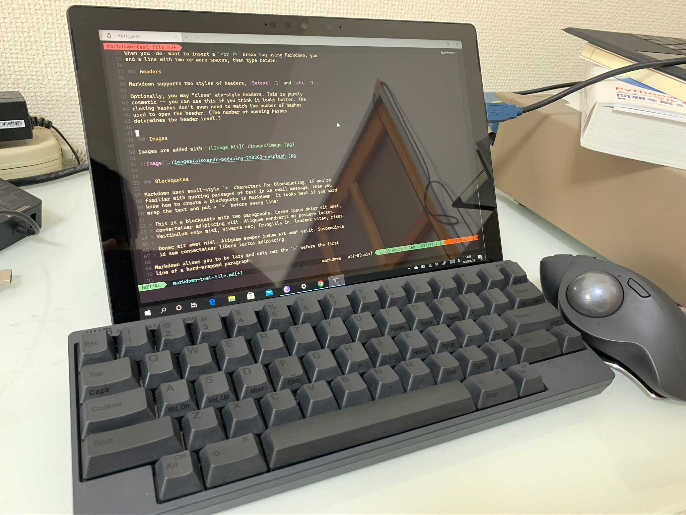

最近までMacをメインで使っていたのですが、計測器制御やグラフソフトのOriginの利用が多くなってきたこと、あとボスがWindowsを使っててなにかとMacだとファイル共有などで不便に感じてたこともあり、Windowsマシンの購入を考えておりましたがなかなか思い切れずにいました。

先日、自分の弟が13万円程度するVRデバイスを購入したと聞き、私もなぜかそれで決心してSurface pro 7を購入しました。
スペックは以下の通りです。

CPU: Core i7 10th Gen
Memory: 16 GB
SSD: 512 GB

キーボード合わせて２６万円程度しました（笑）
ヨドバシカメラで購入したのでそのポイントと学生向けのキャッシュバックキャンペーンを利用して約５万程度安い21万円程度で購入できました。
いつこんなスペック使うんだ・・・って自分でも感じてますが、まあなにをするにもサクサクですね。

先日、高級キーボードのHHKB Hybrid Type-Sも購入したので自宅で使用するときはタイプキーボードを外して下の写真のように使ってます。

にしてもWindows、いいですね。特に最近は。
Unix系という理由でMacを使い続けていましたが、最近WindowsもWSLでLinuxが使えるようになり、しかも結構サクサク使えちゃうんでMac使う理由があんまりなくなってきていました。このブログもWSL上のVimで書いてます。
Adobeソフト群もWindowsの方がよく動くっていう話もあるし、iPhoneとの連携機能、Garage Band、Docker使わないならWindows一択な気もしてます。

使っていたMacbook proはGarage band専用になるかな・・・(笑)
それか研究所にずっと置いとくPCにしようかと思ってます。

